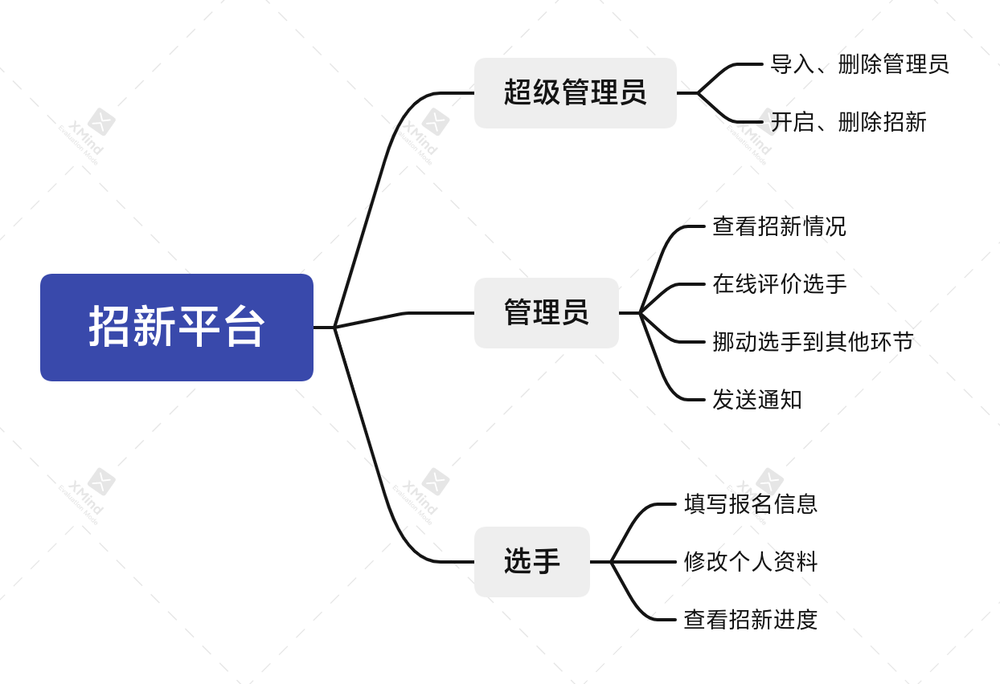
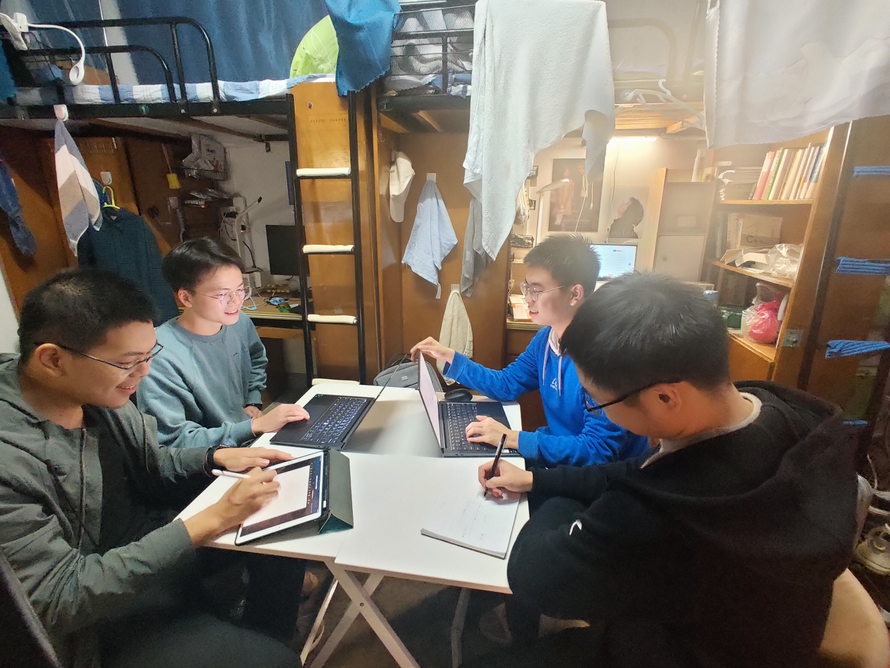

# 软件工程定项第一次会议记录

- **参会者**：陈奕骁、池炜恒、张子礼、姜伟龙
- **时间**：2021 年 10 月 27 号周三，沁苑学生宿舍

## 项目选择
“Maximum Recruitment Platform”面向学生社团的大规模招新协作平台

### 主要技术栈
前后端分离开发。提供PC端服务。

**前端**：Vue 等

**后端**：Spring Boot，jwt/shiro 鉴权，MongoDB 数据库

前后端交流用 RESTful API。

### 团队分工

**前端开发和文档管理**：池炜恒、张子礼、姜伟龙

**后端开发**：陈奕骁

## 项目分析（头脑风暴）

### 现有类似平台的不足

- 市面上常见的 HR 系统往往面向企业提供服务，功能庞杂，可能需要使用专属软件，还很有可能是收费的。

- 使用问卷星等问卷平台报名、使用 excel 等表格软件手动管理信息对招新规模大、招新流程多的情况不适用，也不方便团队成员之间交流信息，还可能造成混乱；手动发送通知短信费时费力，QQ 群通知不够正式和严谨。

- 在一般的招新流程中选手修改简历和查看流程都不方便，可能需要联系团队成员手动确认。

- 即使有一些已有的招新协作平台，扩展性和易部署性也不好，适用场景小，对非技术社团也不友好。

### 改进方式

- [x] 开源、免费、小而美，做好打包，方便学生社团部署。

- [x] 选手报名、成员查看选手信息、发送邮件提示都集成到本系统中。

- [x] 加入简历修改功能，增加用户引导。

- [x] 提供选手在线评价功能，综合评价一目了然。

- [x] 内嵌招新模板，一键开启招新。

- [x] 界面现代化，用户友好。

### 题目来源

大学生活中常见的痛点。

### 需求

超级管理员可以导入、删除管理员，删除普通用户；可以开启、删除新的招新，设置招新的时间、环节等。

普通管理员可以查看招新的概况，查看招新每个环节下有哪些同学，挪动选手到不同的环节。

普通用户可以注册，填写个人资料报名招新，随时修改自己的信息，查看当前所在招新环节，可以放弃招新。

支持通过模板给选手批量发送邮件。

报名的时候填写：
- 个人信息，如姓名、性别、学院、专业、年级、推荐人、邮箱、电话等
- 自我介绍
- 简历或作品集

数据可视化，包括各个环节的人数，各届招新的人数等等。

支持导出选手名单。

（附加功能）集成选手评价功能。

（附加功能）一键跳转其他可能有需求的应用。

（附加功能）确认收到信息回执。

## 思维导图

## 会议图片

