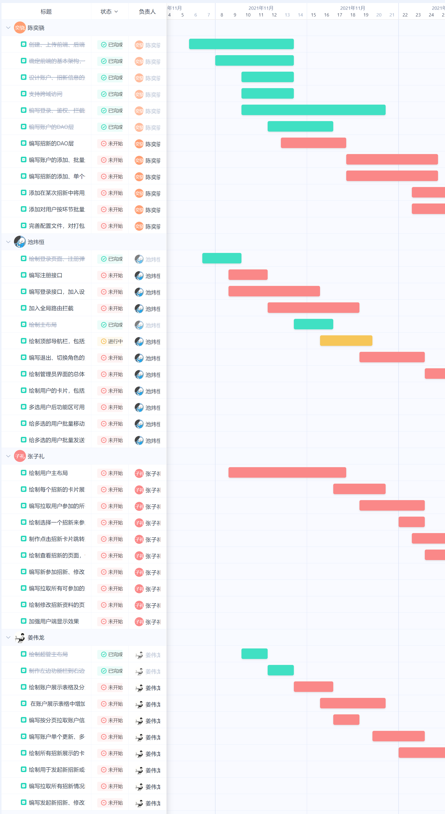

# 进度计划

## 进度安排

https://yjak20211110091734666.worktile.com/mission/project-groups/all

TODO: 

## 大致计划

前端：一天 HTML+CSS，一天 js，两周 Vue 及 UI 框架，两周具体页面开发。

后端：一周框架，一周数据库，一周鉴权，一周接口。

Vue 重点学习表单提交、数据展示、组件。包括Vue 的循环条件等操作。

## 详细计划

### 后端、数据库 陈奕骁

1. 创建、上传前端、后端基本工程；
2. 确定前端的基本架构，包括路由、UI、请求等功能的套件选择等；
3. 设计账户、招新信息的数据库字段；
4. 编写账户的DAO层；
5. 编写招新的DAO层；
6. 编写账户的添加、批量删除、批量修改权限、分页拉取、单个更新接口；
7. 编写招新的添加、单个修改、分页拉取接口；
8. 添加在某次招新中将用户批量挪动到其他环节的接口；
9. 添加对用户按环节批量发送邮件的接口；
10. 支持跨域访问；
11. 编写登录、鉴权、拦截的整套逻辑；
12. 完善配置文件，对打包友好。

### 前端/管理员、前端/登录系统 池炜恒

1. 绘制登录页面、注册弹窗；
2. 编写注册接口；
3. 编写登录接口，加入设token逻辑；
4. 加入全局路由拦截；
5. 绘制主布局；
6. 绘制顶部导航栏，包括退出和切换角色功能；
7. 编写退出、切换角色的接口；
8. 绘制管理员界面的总体布局；
9. 绘制用户的卡片，包括点击查看具体信息的弹窗；
10. 多选用户后功能区可用；
11. 给多选的用户批量移动到其他环节；
12. 给多选的用户批量发送带模板的邮件；

### 前端/超级管理员 姜伟龙

1. 绘制超管主布局
2. 制作左边功能栏到右边内容展示的逻辑
3. 绘制账户展示表格及分页栏
4. 编写按分页拉取账户信息的逻辑
5. 在账户展示表格中增加多选框、单个更新的按钮、多个删除的按钮、多个更新权限的按钮，以及相应的弹窗
6. 编写账户单个更新、多个删除、多个更新的接口
7. 绘制所有招新展示的卡片，包括点击显示其详细信息、单个更新、发起新招新的按钮
8. 绘制用于发起新招新或修改某个招新的弹窗，完善其条件显示逻辑
9. 编写拉取所有招新情况的接口
10. 编写发起新招新、修改某个招新的接口

### 前端/用户 张子礼

1. 绘制用户主布局
2. 绘制每个招新的卡片展示
3. 编写拉取用户参加的所有招新的信息的接口
4. 绘制选择一个招新来参加招新的逻辑，包括填写招新需要的一些信息等弹窗
5. 制作点击招新卡片跳转到查看招新的逻辑
6. 绘制查看招新的页面，包括查看当前到哪个招新环节，当前招新的资料。
7. 编写新参加招新、修改已有招新资料的接口
8. 编写拉取所有可参加的招新的接口
9. 绘制修改招新资料的页面
10. 加强用户端显示效果

### 发布、测试

共同完成
