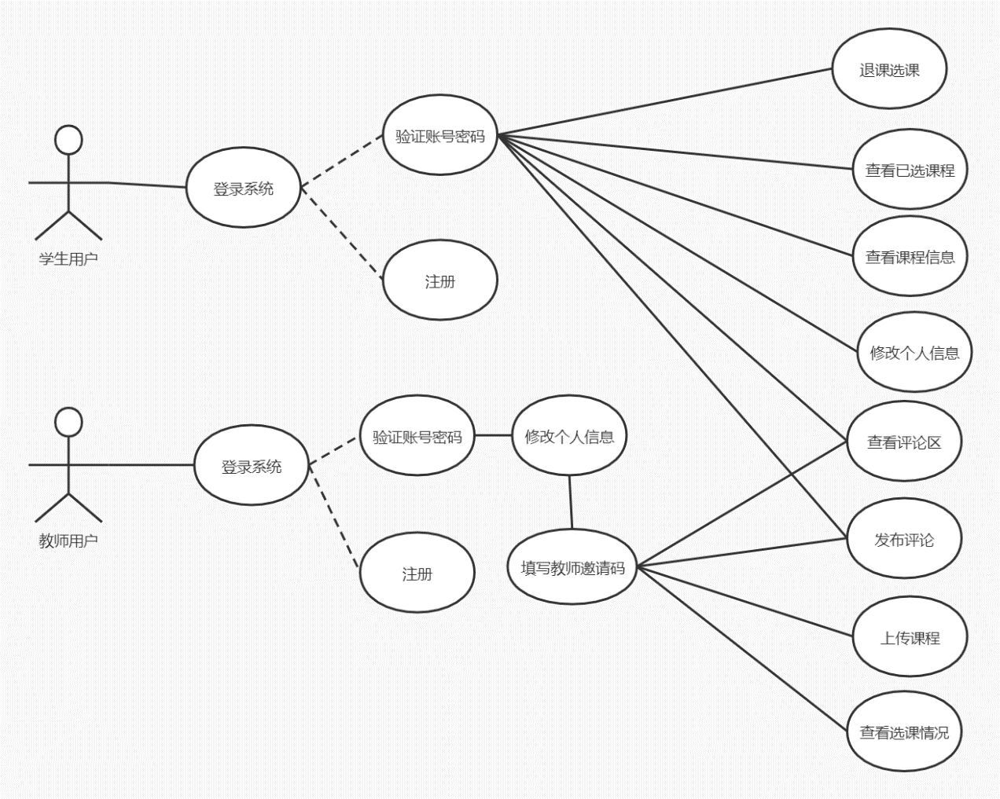
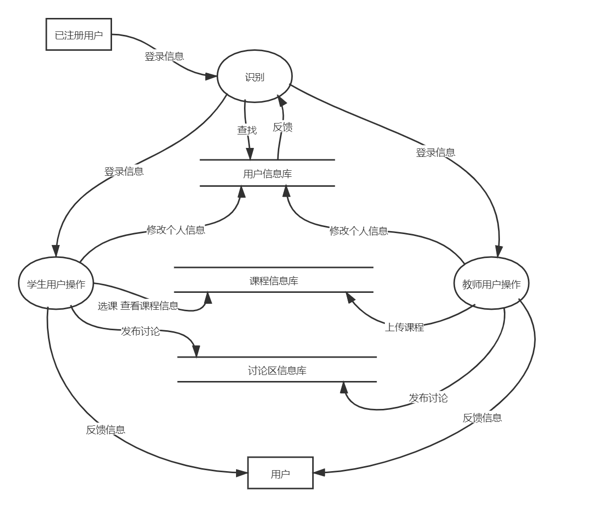
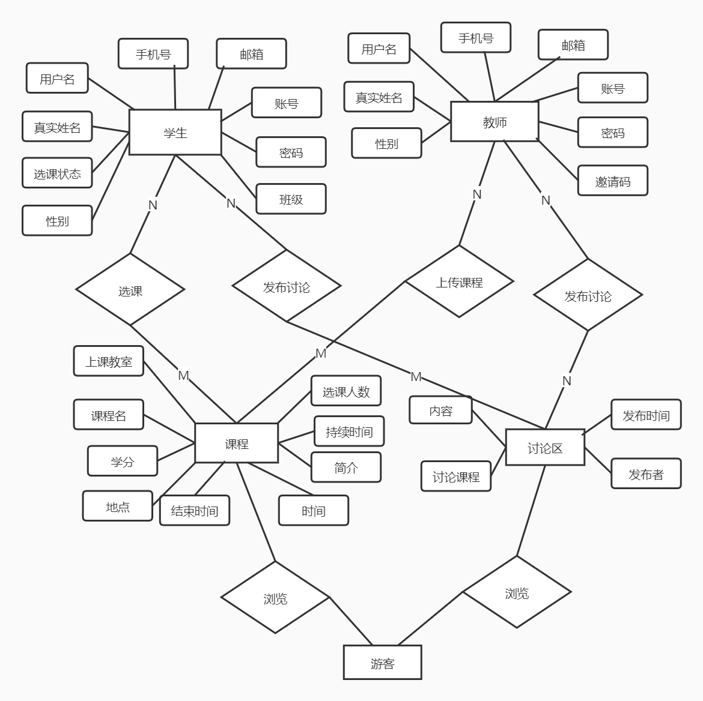
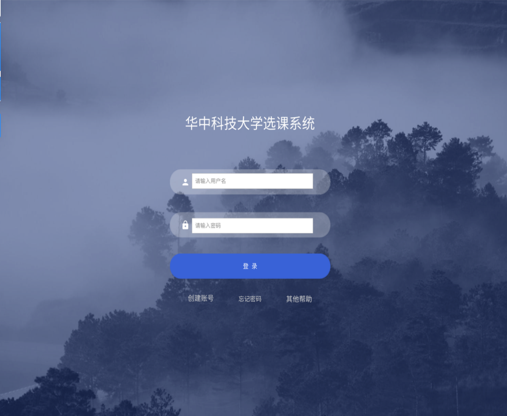
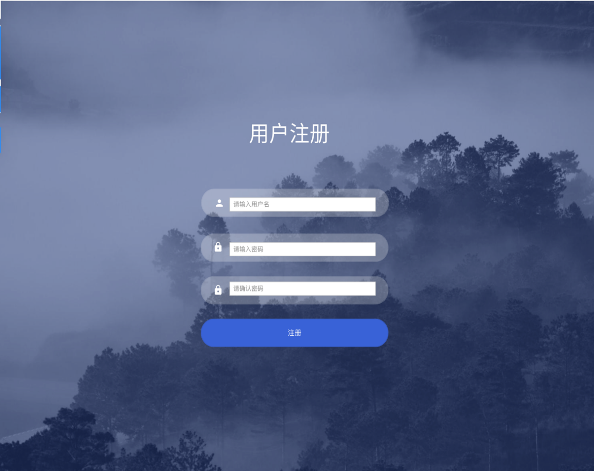
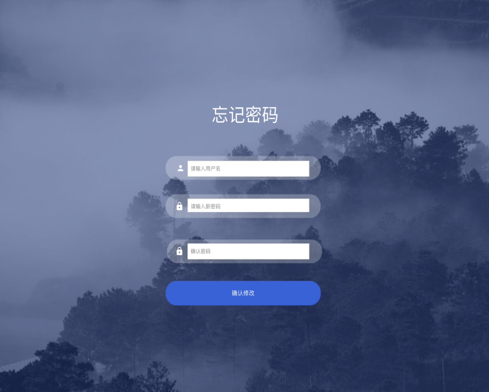
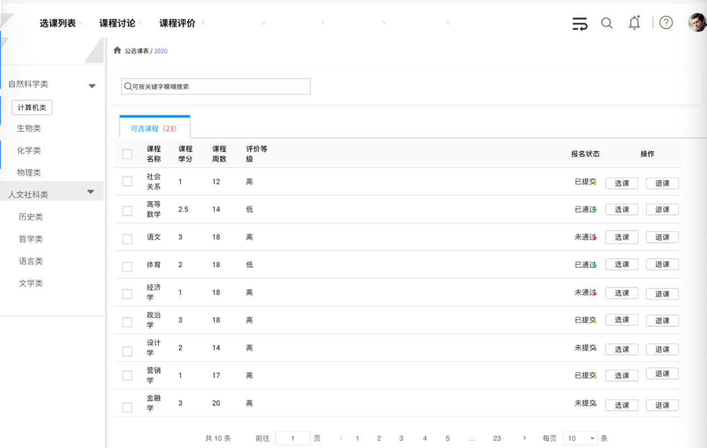
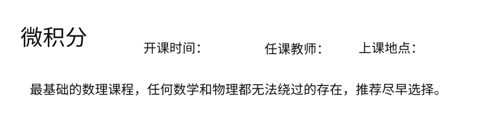

## 产品描述
经过小组讨论我们决定以网站的形式实现我们的选课系统，在项目管理上使用Gitee平台对我们的代码和资源文件进行管理，构建用于存储用户信息和课程信息的数据库，租用服务器用于部署我们的网站。我们的基本目标是在网页上实现一个选课系统。

## 产品功能
选课系统针对不同用户实现不同的功能。
游客：浏览课程信息但无法选课和评论；
学生：登录、注册、填写个人信息、查看课程信息、选课、退课、查看评论区、评论；
教师：登录、注册、填写个人信息、填写教师邀请码成为教师账号、上传课程、查看课程信息、查看评论区、评论；
管理员：查看后台数据，进行权限和数据管理

## 系统用例
系统中最重要的两个角色是学生和教师，他们的功能涵盖了整理功能的90%，其用例图如下：

## 系统数据流图
系统运行数据流图如下

## 系统ER图
有上述描述可以得到系统的ER图如下

## 系统功能描述
基于web开发，因此初步设计五个页面，登入界面、注册界面、选课主界面、修改密码界面、课程介绍界面。

### 用户登入
主要有大标题表明我们要登陆的的是一个选课系统的界面。其次要有登陆的基本信息：用户的用户名以及密码，以及需要一个登陆按键来支持页面的跳转，以及向后端发送post请求。其次还要有创见账号的按键提供用户进行选择，用户点击创建账号应该可以跳转到注册账号的信息，给用户提供注册功能。再者还有给用户提供忘记密码这个按键，防止用户忘记自己的密码导致无法登入选课系统，忘记密码可以让用户修改自己账号的密码从而可以用修改后的密码进行登录，最后还有其他帮助的按键提供用户一些基本的帮助。具体效果如图所示。

### 用户注册
主要有大标题表明这个界面是一个用户注册的界面。其次注册账号的基本信息：用户的用户名以及密码，以以及一个确定密码的操作，防止用户一次输入密码与自己想的密码不一致的尴尬，提供用户捡错密码的功能。以及需要一个注册按键来支持页面的跳转，以及向后端发送post提供给后端注册时的具体信息。请求具体模型如图所示。

### 密码维护
主要有大标题表明这个界面是一个忘记密码用于 修改账号 密码的界面。其次有修改密码提供的基本信息：用户的用户名以及密码，以以及一个确定密码的操作，防止用户一次输入密码与自己想的密码不一致的尴尬，提供用户捡错密码的功能。以及需要一个确认修改的按键来支持页面的跳转，以及向后端发送post提供给后端修改密码 时的具体信息。请求具体模型如图2-3-3所示。

###	选课页面
四个模块组成：第一个模块最上方的的选课列表、课程讨论、课程评价的跳转按钮，提供给用户跳转到课程讨论、课程评价的功能；第二个模块为右上角的用户模块，有用户的头像以及帮助注销等功能，注销可以退出当前登录的账号，头像是一个跳转界面可以提供给 用户跳转到个人信息的界面；第三个模块是左边的课程分类界面，将主界面中的课程进行分类，提供给用户通过课程分类进行筛选的功能，方便用户的检索课程；第四个模块是中间的课程信息主模块，有课程的基本信息的介绍（课程的名字，学分，上课周数，评价等级和当前用户的报名状态等），用户可以根据自己喜欢的课程类别进行选课和退选的操作。还有一个搜索课程的功能提供给用户进行查课的功能。具体的模型如图所示。

### 课程信息
具体页面有以下几点组成，首先是当前课程的名字，然后根据名字提供具体的开课时间、任课教师、以及上课地点的基本信心，还有该课程的具体信息课程概要提供给用户，让用户知道具体课程的具体细节。具体的模型如图所示。
